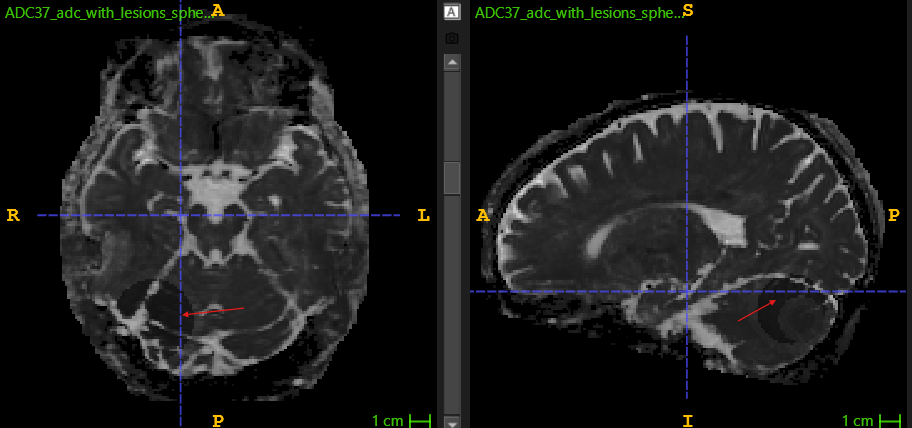
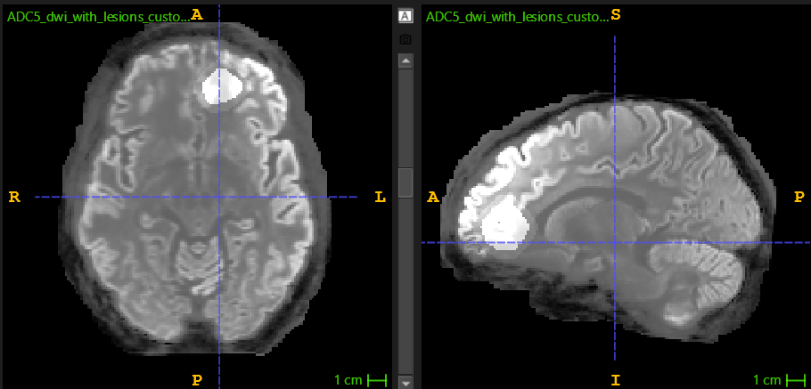
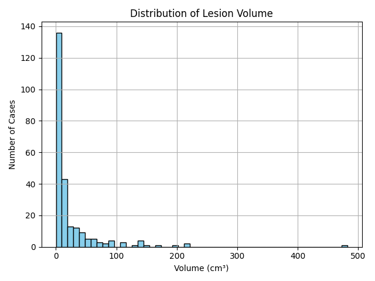
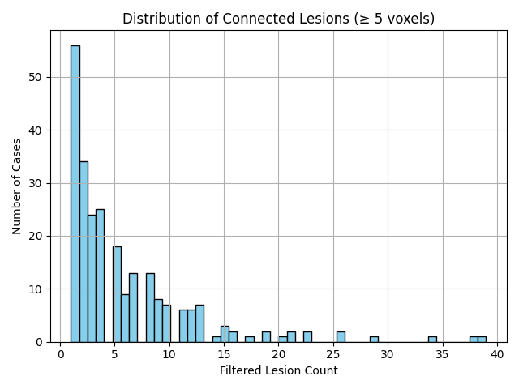
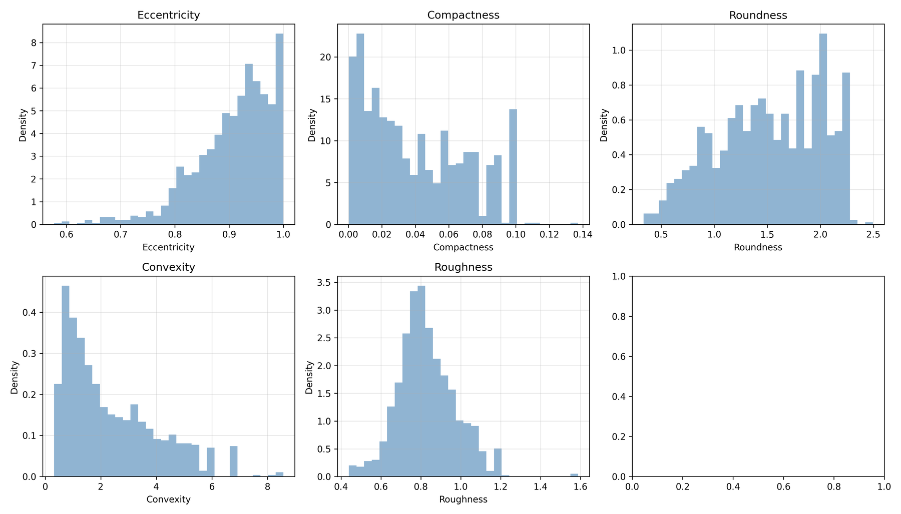
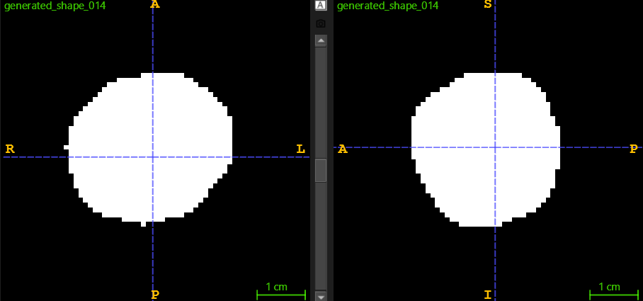
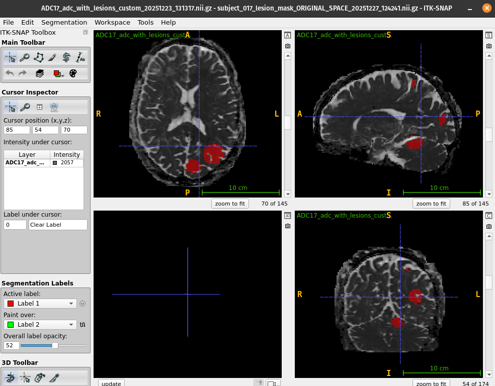
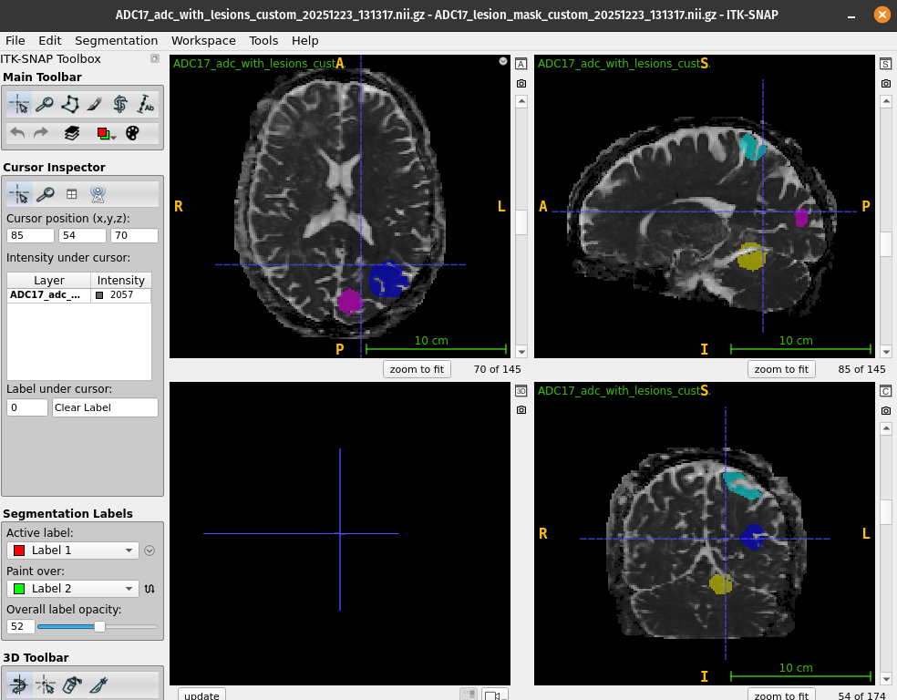

# Synthetic Stroke Lesion Simulation and Deep Learning Segmentation

**EPFL — Signal Processing Laboratory 5 (LTS5) · Semester Project · January 2026**

Automatic segmentation of acute ischemic stroke lesions in diffusion MRI is clinically valuable
but bottlenecked by the cost of voxel-wise expert annotation. This project asks whether that
bottleneck can be bypassed: **measure the statistics of real lesions, simulate new ones on
healthy brains, and train a segmentation network on the result.**

The pipeline measures lesion statistics from **ISLES-2022**, uses them as empirical priors to
insert synthetic lesions into healthy **Human Connectome Project** scans, and trains a **3D
Attention U-Net** on mixtures of real and synthetic data.

**All four synthetic configurations reach > 0.81 Dice on real ISLES validation data, against a
0.726 baseline trained on ISLES alone.**

📄 **[Full report (PDF)](FinalReportBOUBAKRY_LTS5.pdf)** — derivations, the full statistical
analysis, and the complete results discussion.

| ADC — synthetic lesion (hypointense) | DWI — synthetic lesion (hyperintense) |
|---|---|
|  |  |

*The multi-modality intensity model in action. Acute infarcts restrict water diffusion, so they
appear **dark on ADC** and **bright on DWI** — the generator enforces both directions on the same
voxels, because a lesion that violated this relationship would be trivially identifiable as fake.*

---

## Pipeline

```
   ISLES-2022                              HCP (healthy subjects)
   DWI + ADC + expert masks                DWI + ADC
        │                                        │
        ▼                                        │
   ┌─────────────────────────────┐               │
   │ 1. Statistical analysis     │               │
   │  volume, multiplicity,      │               │
   │  ADC/DWI contrast,          │               │
   │  SynthSeg localization,     │               │
   │  KDE spatial prior,         │               │
   │  morphological descriptors  │               │
   └──────────────┬──────────────┘               │
                  │ empirical priors             │
                  ▼                              ▼
        ┌────────────────────────────────────────────┐
        │ 2. Synthetic lesion generation             │
        │  intensity harmonization → tissue masks →  │
        │  sample count & volume → place centers →   │
        │  shape (spherical | shape library) →       │
        │  apply ADC↓ / DWI↑                         │
        └──────────────────────┬─────────────────────┘
                               │ synthetic volumes + masks
                               ▼
        ┌────────────────────────────────────────────┐
        │ 3. 3D Attention U-Net (MONAI)              │
        │  patch-based, class-balanced sampling      │
        │  evaluated on REAL ISLES validation data   │
        └────────────────────────────────────────────┘
```

---

## 1. Statistical analysis

The goal is not to reproduce the *average* lesion but the **variability** that makes stroke
segmentation hard. Lesion masks are analysed in 3D with 26-connectivity; tiny components are
dropped (< 5 voxels for counting, < 10 for shape descriptors) to avoid fitting priors to
spurious detections.

| Quantity | Finding | Code |
|---|---|---|
| Lesion volume | Long-tailed — most infarcts small to moderate, a minority very large | `strokevolume.py`, `statisticalanalysis.py` |
| Multiplicity | Varies widely, and can be high even when total volume is not | `statisticalanalysis.py` |
| ADC / DWI contrast | Mean intensity inside lesion masks, per modality | `statisticalanalysis.py` |
| Anatomical location | Per-region lesion frequency via SynthSeg parcellation | `localization.py` |
| Spatial prior | KDE over lesion centres of mass | `localization.py`, `modelfitting.py` |
| Shape | Eccentricity, compactness, roundness, convexity, roughness | `morphological_analysis.py` |

| Lesion volume | Lesion multiplicity |
|---|---|
|  |  |

*Both distributions matter for simulation: the model has to detect large territorial infarcts
**and** multiple scattered embolic foci, so the generator has to produce both.*



*The five morphological descriptors measured on real ISLES lesions. Eccentricity concentrates
near 1 and compactness near 0 — real infarcts are strongly elongated and irregular, nothing like
spheres. These distributions become the objective the shape generator optimises against.*

---

## 2. Synthetic lesion generation

**Intensity harmonization first.** ISLES and HCP come from different scanners and protocols, so
ADC units are normalized and histograms matched by percentile mapping before any lesion
statistic measured on ISLES is applied to an HCP volume (`intensityshift.py`).

**Anatomical constraints.** SynthSeg parcellations give tissue-validity masks, so lesions land in
plausible tissue rather than in ventricles or outside the brain.

**Two shape modes:**

- **Spherical** — the minimal setting, to answer whether realism is even needed.
- **Non-spherical** — templates drawn from a shape library generated by fitting the
  morphological descriptor distributions above, then embedded and scaled to the sampled volume
  (`shapegenerationV2.py`, `generationshapeold.py`).



**Placement** is either uniform-random or drawn from the KDE spatial prior over real lesion
centres. **Intensity** is then applied with the modality-consistent model: ADC decreased, DWI
increased.

---

## 3. Segmentation model

A **3D Attention U-Net** (MONAI). Attention gates on the skip connections weight the encoder
features by a gating signal from the decoder, suppressing background activations — well matched
to stroke lesions, which occupy a tiny fraction of the brain volume, where naive skip connections
propagate background texture and inflate false positives.

| | |
|---|---|
| Input channels | 2 (ADC and DWI concatenated) |
| Encoder channels | (16, 32, 64, 128), strides (2, 2, 2) |
| Dropout | 0.1 |
| Patch size | (96, 96, 16) |
| Patch sampling | ~1:2 background-to-lesion in training; 1:100 in validation |
| Intensity clamping | ADC [10, 3000], DWI [5, 1800] |
| Augmentation | Random affine (p 0.3), Gaussian noise (p 0.5) |
| Optimizer | Adam, lr 1e-2, cosine annealing to 1e-4 over 200 epochs |
| Loss | MONAI `DiceCELoss` (sigmoid) |
| Split | 85 % train / 15 % validation |

The class-balanced cropping is the load-bearing choice: lesion voxels are rare enough that
uniform sampling collapses the network to predicting all-background.

---

## Results

| Training configuration | Val Dice (all) | Val Dice (ISLES) | Val Dice (synth) | Precision | Recall |
|---|---|---|---|---|---|
| Baseline (Attention U-Net, ISLES'22 only) | 0.726 ± 0.004 | 0.726 ± 0.004 | — | — | — |
| ISLES + **spherical** synthetic | **0.8517** | 0.8278 | 0.8329 | 0.8553 | **0.8700** |
| ISLES + **non-spherical** (16 shapes) | 0.8435 | 0.8142 | **0.8599** | 0.8475 | 0.8625 |
| ISLES + non-spherical + **localization** | 0.8422 | 0.8182 | 0.8554 | 0.8651 | 0.8460 |
| ISLES + non-spherical + localization + **intensity priors** | 0.8272 | **0.8286** | 0.8073 | **0.8665** | 0.8110 |

### The interesting part: more realism did not help

The **simplest spherical model performed best overall** — the opposite of what you'd expect.
Under Dice-based optimization, compact regular shapes are a strong inductive bias for
localization: overlap metrics reward smooth boundaries, so the network learns to emit compact
components and scores well even when boundary accuracy is mediocre.

Adding geometric realism **improved synthetic Dice but slightly reduced real-ISLES Dice** —
evidence of a domain gap. Those models capture irregular outlines better but produce more
fragmented predictions and spurious detections near ventricular borders and deep white matter,
where synthetic shape boundaries interact badly with partial-volume effects. Increasing realism
along one axis does not help if the synthetic boundary statistics still don't match real ones.

Adding **localization priors** traded recall for precision — the best precision (0.8651–0.8665)
came from the localized configurations, consistent with anatomically implausible false positives
being suppressed.

### Visual inference

| Model prediction | Synthetic ground truth |
|---|---|
|  |  |

*A deliberately hard case. Most components are segmented well, but in the sagittal view
(top-right) the model misses a lesion component present in the ground truth — the
under-segmentation of small, low-contrast lesions discussed in the report.*

---

## Code

| File | Purpose |
|---|---|
| `statisticalanalysis.py` | Lesion volume, multiplicity, intensity contrast, KDE fitting |
| `strokevolume.py` | Volume distribution fitting |
| `morphological_analysis.py` | 3D shape descriptors (eccentricity, compactness, roundness, convexity, roughness) |
| `localization.py` | SynthSeg-based anatomical localization + KDE spatial prior over lesion centres |
| `modelfitting.py` | Fits and exports KDE models per descriptor |
| `coordinate.py` | Centre-of-mass and coordinate utilities |
| `intensityshift.py` | ADC normalization and ISLES→HCP histogram matching (Tk GUI) |
| `shapegenerationV2.py` | **Main generator** — batch synthetic lesion insertion into ADC/DWI pairs |
| `generationshapeold.py` | Earlier morphology-driven shape generator |
| `showdatapersubject.py` | Per-subject inspection GUI |
| `train.py` | 3D Attention U-Net training/validation (adapted from Haoxuan Wang's 2024 master's project) |

Several scripts open a **Tkinter file dialog** to choose input folders rather than taking
command-line arguments, so run them interactively.

### Dependencies

```bash
pip install numpy scipy scikit-image pandas matplotlib seaborn nibabel nilearn torch monai tqdm wandb
```

`tkinter` ships with most Python installations. [SynthSeg](https://github.com/BBillot/SynthSeg)
is run separately to produce the parcellations in `HCPDATA/Synthseg*/`.

---

## Repository contents

```
Code/                    analysis, generation and training scripts
checkpoints/             trained Attention U-Net weights, one per configuration
Shapes/                  generated lesion shape libraries (.pkl) and sample shapes
training_logs/           Weights & Biases run logs
figures/                 figures used by this README, extracted from the report
FinalReportBOUBAKRY_LTS5.pdf
```

### The datasets are not in this repository

`HCPDATA/` is excluded via `.gitignore`, for two independent reasons:

1. **Licensing.** Human Connectome Project data is distributed under a Data Use Agreement that
   does not permit redistribution. ISLES-2022 has its own terms. Neither can be mirrored here.
2. **Size.** The local copy is ~2.3 GB, including five ~370 MB generated-dataset archives — well
   past GitHub's 100 MB per-file limit, so they cannot be pushed regardless.

To reproduce, obtain the data at source and recreate the layout:

```
HCPDATA/
├── Files/HCP_Dataset/     ADC{n}.nii.gz, DWI{n}.nii.gz   (HCP, 45 subjects)
├── Synthseg/              SynthSeg{n}.nii.gz              (SynthSeg parcellations)
└── Synthseg2/             ADC{n}_synthseg.nii.gz
```

- **HCP** — https://www.humanconnectome.org/ (registration + DUA required)
- **ISLES-2022** — https://isles22.grand-challenge.org/
- **SynthSeg** — https://github.com/BBillot/SynthSeg

---

## Limitations

Stated plainly, as in the report: the evaluation is patch-based with dataset-specific
preprocessing and sampling, so the numbers are **not** directly comparable to published
benchmarks, which need matched splits and full-volume inference. Results above some published
baselines are encouraging but need confirmation on unseen external cohorts. Modelling lesions to
closely match real pathological appearance was not fully achieved — the domain gap above is the
direct evidence.

Future directions: ADC-driven lesion modelling, core/rim contrast rather than homogeneous
intensity, region-specific priors, and Kolmogorov–Smirnov testing between real and synthetic
descriptor distributions to verify the shape prior quantitatively.

---

## Author

**Ahmed Boubakry** — EPFL, Section de Microtechnique

- Supervisor: **Prof. Jean-Philippe Thiran**
- Co-supervisor: **Jonathan Rafael Patiño Lopez**
- Laboratory: Signal Processing Laboratory 5 (LTS5)

`train.py` is adapted from Haoxuan Wang's 2024 master's project.

## Key references

ISLES-2022 (Hernandez Petzsche et al., 2022) · HCP (Van Essen et al., *NeuroImage* 2013) ·
SynthSeg (Billot et al., *Medical Image Analysis* 2023) · U-Net (Ronneberger et al., MICCAI 2015) ·
Attention U-Net (Oktay et al., 2018) · MONAI · NiBabel. Full list in the report.
